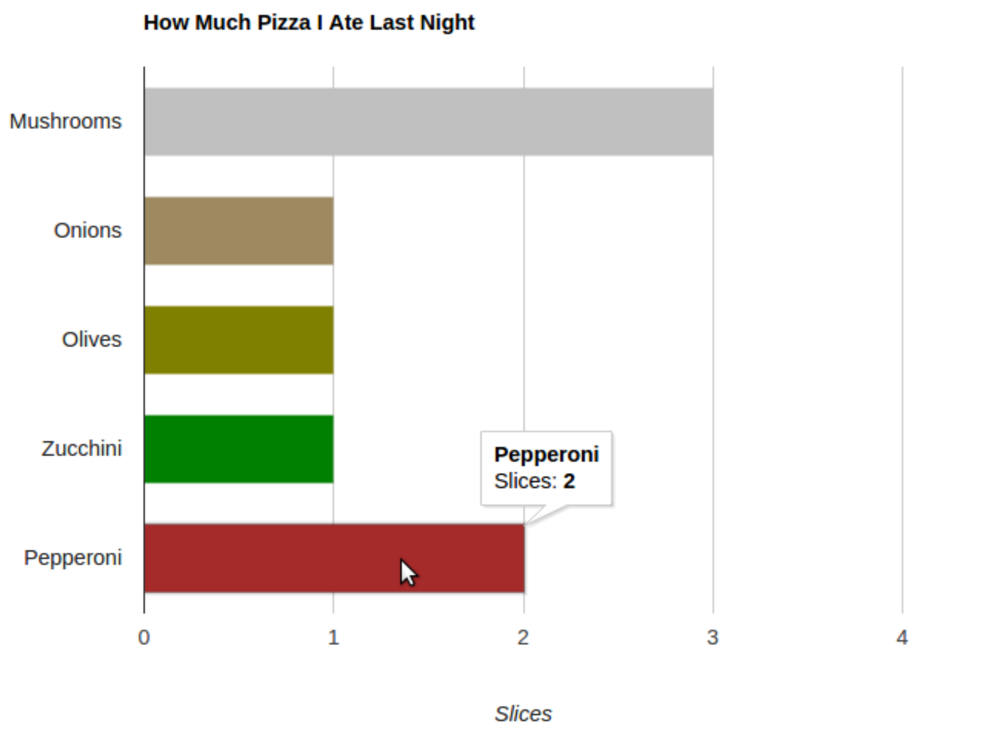
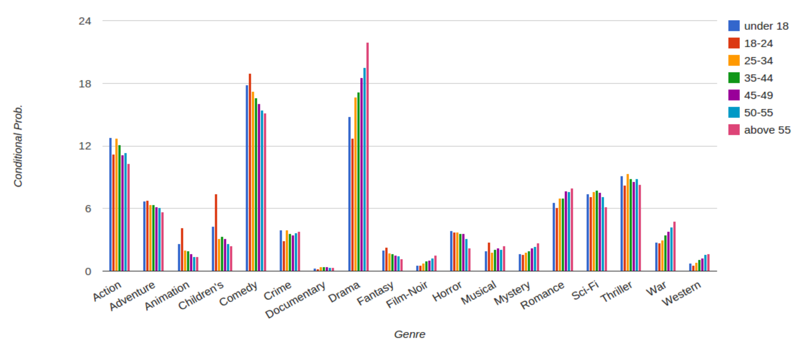
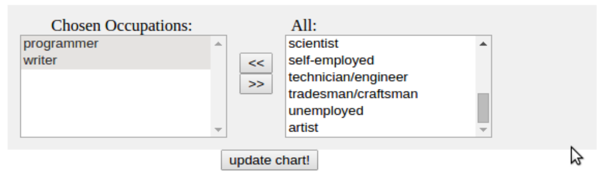
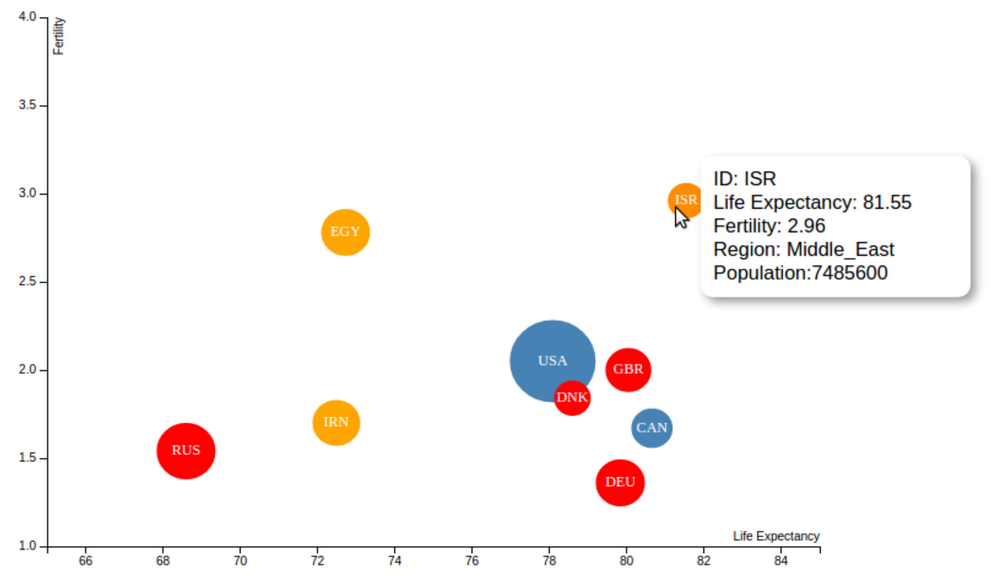
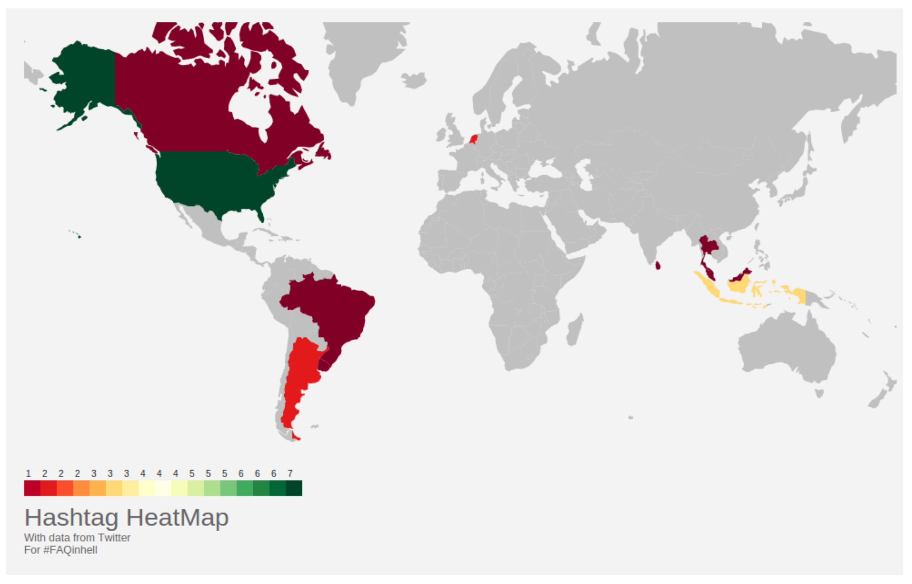

<style>
table.small-table {
    font-size: 16px;
    border-collapse: collapse;
    border-spacing: 0;
    border: 0px
    padding-bottom: 0em
}
table.small-table td {
    padding: 0px
}
td {
    border: 0px;
}
</style>

## Readings

Depending on how familiar you are with web programming, you are recommended to
study concepts related to CSS, HTML, and JavaScript. The following pages will
help you pick up these concepts at a very basic level:

* <http://www.w3schools.com/css/>
* <http://www.w3schools.com/js/default.asp>
* <http://www.w3schools.com/html/default.asp>
* <http://alignedleft.com/tutorials/d3/fundamentals>

Debugging will be part of our programming while going through this assignment. Familiarize yourself with
the web inspector tools available on your browser. All Safari, Chrome, and Firefox web browsers, have
debugging tools.

## Goal

In this assignment, we will create web-based visualizations. In the first part, we will use the Google
Charts API, a simple free visualization API, to generate standard visual graphics such as pie charts, bar charts,
lines or maps. Later on, we will use the visualization library D3 to give us flexibility
to design different visual graphs.

## Instructions

You will need to submit an HTML file for each question. Make sure your files can be viewed
on a browser and are named with the file-names defined at the end of each question.

# Google Charts

The main advantage of Google Charts API is its simplicity and its power in generating standard charts. The
documentation of this API can be found below:
<https://developers.google.com/chart/>

The following is a list of all available charts:
<https://developers.google.com/chart/interactive/docs/gallery>


Figure 1: A potential output for Question 1.

## Question 1

As an introduction to Google API, we will create our own “Hello Bar Chart!" by modifying the
simple pie chart code: “Hello Charts!”. First, follow the instructions presented below to reproduce the pie
chart:
<https://developers.google.com/chart/interactive/docs/quick_start>

On the left-side menu under “Hello Charts!”, you can find follow-up instructions on loading the libraries,
preparing the data, changing options, and drawing the chart. Briefly check these instructions.
Now change the pie chart to a bar chart. Set the color of each bar to your desired colors. Give a title to
the horizontal axis and place it under it. Your final visualization should look like Fig. 1. Name your final
HTML file `“index1.html”`. Submit this file as your answer to this question.

## Question 2

In this section, we will create visualizations based on conditional probabilities
for movie genres and viewer groups. The data below shows a comma separated table that contains the
probability (in %) of a viewer watching a movie with a particular genre, given the viewer’s group.
```
Group,Action,Adventure,Comedy,Crime,Drama,Horror,Romance,Sci-Fi,Thriller
Female,9.02,5.40,19.03,3.25,19.40,2.89,9.94,5.42,7.97
Male,13.27,6.68,16.31,3.95,16.06,3.87,6.09,8.14,9.36
```


Figure 2: A potential output for Question 2.

Use these probability values to create a Google column chart. The column chart should represent the probability values for each genre comparing male and female groups. Fig. 2 shows an example of the column chart
you should get. Name your final HTML file `“index2.html”` for this question.

## Question 3

If we run analyses of our data as it changes on a daily basis, it is desired that any resulting
graphs update automatically. The first step to automating the visualization process is to load the input data
dynamically.
Start with a copy of the code that you developed in the previous question (column chart). Modify your code
such that the input data is loaded from the following external file:
[age_genre_p.csv](data/age_genre_p.csv)

This file contains the conditional probability values for different age groups. Your output for this part should
look like Fig. 3. Name your final HTML file `“index3.html”`. Hint: The following tutorial can be helpful for
this question:
<http://economistry.com/2013/07/easy-data-visualization-with-google-charts-and-a-csv/>


Figure 3: A potential output for Question 3.

You can use this code, if you find it useful:
```
function transposeArray(array) {
  return array[0].map(function (col, i) {
    return array.map(function (row) {
      return row[i];
    });
  });
}
```

## Question 4

Let’s add user interactions to our column chart. Start with a copy of the code that you developed
in the previous question. Modify your code such that a user can select a subset of viewer groups. Here we
will use [occupation_genre_p.csv](data/occupation_genre_p.csv).

This file contains the joint conditional probabilities for different users' occupations. Your output may look
like Fig. 4. Use the file name `“index4.html”` for this question.

**Hint:** The following page may be helpful for creating multiple selection fields:
<http://stackoverflow.com/questions/15696415/html-multiple-select-box>



Figure 4: A potential output for Question 4.

# D3 Visualization Library

You may have noticed in the previous part that the Google Charts API brings us the simplicity of creating a
rich graphical chart with a few lines of code. This simplicity comes at a cost. By using an API, we limit our
design to the capabilities that are offered by the API. In other words, we follow a design-by-configuration or
template-based design approach. For example, in the previous section, we could easily create a column chart
with a few lines of code. But customizing the chart (e.g. changing the background color) can be very tedious
or even impossible if not supported by the API. This often ends up being impractical. Most applications
require more flexibility in terms of design and customization of graphical elements. For such applications, D3 is
an ideal library to use.

In this part, we will create visualizations using the D3 library. The following links are documentations and
examples for D3:
<https://github.com/mbostock/d3/wiki>
<https://github.com/mbostock/d3/wiki/Gallery>

To get set up, you can follow the first steps described here:
<https://www.dashingd3js.com/d3js-first-steps>

## Question 5

Use D3 to create a bubble chart as close as possible to the graph on top of the following example:
<https://developers.google.com/chart/interactive/docs/gallery/bubblechart>

The data used to create this bubble chart corresponds to life expectancy information and can be found here:
[Life expectancy at birth per country](data/nations.csv) [Source [World Bank Indicators](https://data.worldbank.org/indicator?tab=all) portal]

For doing so, start with the following tutorial that covers basic techniques commonly used in D3. Try to
reproduce the steps as you are going through the tutorial:
<http://bost.ocks.org/mike/bar/>

You should now be able to apply the techniques used in the tutorial to create the life expectancy bubble chart
via D3. Avoid directly using Google searches for creating this bubble chart! Your output should look like
Fig. 5. Name your final HTML file `“index5.html”` for this question.


Figure 5: Your visualization for question 5 should look like this graph. Make sure to include tooltips
(rectangular box that appears when hovering mouse over a country).

## Question 6

In this question, we will use the Twitter API to fetch a set of tweets related to a query hashtag.
We will extract the geographical information from these tweets corresponding to their location and visualize
these locations on a geographical map using some statistics.
More precisely, using a popular hashtag (e.g. #ethereum), trending at the moment you are reading
this question, we will retrieve a stream of tweets filtering that particular hashtag. Then, we will use D3 to
visualize these tweets’ locations and the number of tweets from users of different countries.

**Step 1: Choose a trending hashtag**
Use either twitter or a third-party website such as <https://www.hashtags.org/> to identify a trending hashtag.

**Step 2: Read Twitter streams containing the hashtag**
Use the following tutorial to write a program that retrieves tweets containing your selected hashtag.
<http://adilmoujahid.com/posts/2014/07/twitter-analytics/>

Run your program for some amount of time (~10 minutes) to get enough tweets. Your program should output
the number of tweets containing the hashtag per country. Ignore the tweets that do not show any geographical
information. Here is an example output for #FAQinHell:

id |number
---|---
NLD|2
BRA|1
CAN|1
LKA|1
USA|7
ARG|2
THA|1
URY|1
MYS|1
IDN|3
{: .small-table }

Note that Twitter and D3 use different standards for country codes. Twitter represents country codes by
a two-letter standard (e.g CA, US, etc.) whereas D3 represents countries by a three-letter standard (e.g.
CAN, USA, etc). In order to convert two-letter country codes to three-letter country codes, you can use the
[ISO alpha-2 and alpha-3 country code csv file](data/country-codes.csv).

Also, note that in the tutorial you are required to import the Tweepy library. This library can be installed on our
lab machines using anaconda as follows:
```
$ conda install --user -c conda-forge tweepy
```

**Step 3: Use D3 to visualize the number of tweets per country** Modify the following example to visualize
the number of tweets per country (computed in the previous step) on a map.
<http://bl.ocks.org/karmi/raw/2366285/>

Your visualization should look somewhat similar to the map in Fig. 6. Name your final HTML file `“index6.html”` for this
question.


Figure 6: Example output for Question 6: #FAQinHell tweets all over the world!
