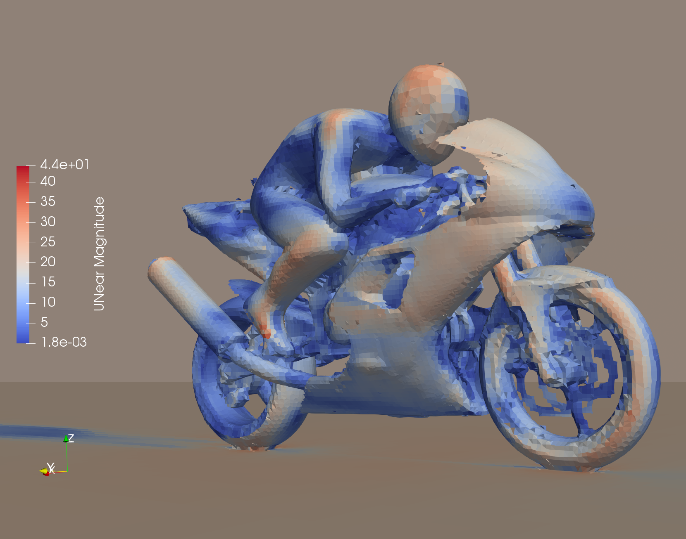
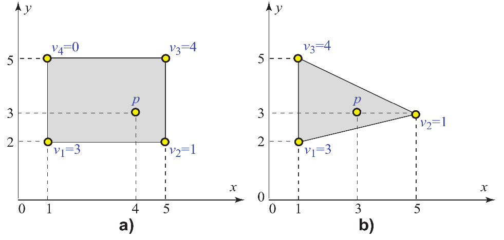

In this assignment you will apply different techniques for visualization of spatial data with scalar and multi-variate attributes.

# Preparation

### Background reading
* Find related material in [A. Telea's book](http://www.cs.rug.nl/svcg/DataVisualizationBook/DataVisualizationBook), Ch. 3-6
* [Paraview tutorial](../paraview-tutorial), also see [link](../paraview-tutorial#/1) to Kitware's tutorial

### Instructions for submission and software setup

You will need to submit result figures and paraview state *.pvsm* files for questions 1+2. Make sure your files can be viewed and are fully compatible with [ParaView-5.6.0-RC3](../paraview-tutorial#/2) as installed in the lab and are named with the filenames given at the end of each question.

Also, you may need to make use of a tool called CDO (Climate Data Operators), documented [here](https://code.mpimet.mpg.de/projects/cdo/embedded/index.html), which is available in the lab if you use the provided conda environment, for instance, by following these steps:
```
mkdir ~/.conda/envs
ln -s /usr/shared/CMPT/big-data/condaenv/py36 ~/.conda/envs
source activate py36
cdo -h
```

### Data

The datasets for this assignment are available [here](http://cs-bahamas.cmpt.sfu.ca:8080/), e.g., via `wget`. This temporary link will be available until the submission deadline. If the link breaks, check back here for an update. To avoid quota limits in the lab, consider downloading the data to `/tmp/$LOGNAME`. When saving your work, be aware that your *tmp* folder is removed upon logout.

# Q1: Motor bike airflow

Let's apply what we've learned about volumetric data visualization to study some aspects of aerodynamics.

**Data:**
Use `motorBike_500.vtk` as data source, which originates from a [flow simulation](https://github.com/OpenFOAM/OpenFOAM-6/tree/master/tutorials/incompressible/simpleFoam/motorBike) in OpenFOAM. The meaning of the variables in this dataset is documented in a [paraview tutorial slide](../paraview-tutorial#/motorbike-fields).

**Tasks:**
* Show the surface of the model for motorbike and rider. Check the [advanced rendering properties](https://blog.kitware.com/effectively-using-the-properties-panel-in-paraview/) of the surface to find a way to remove the front of the surrounding box from view.
* Color the surface of bike and rider to indicate magnitude of tangential forces resulting from wind flow.
* Add a planar slice, mid-sagittal to the rider, that shows kinetic energy of turbulence. Use transparency to retain visibility of structures on both sides of the slice.
* Add streamlines originating orthogonally from a vertical line in front of the bike inside the slice that you created, but ensure that their paths are traced in 3D allowing them to leave the slice. Use only a few (20 or so) streamlines by adjusting resolution of the source and render them as tubes.
* Draw a 3D Q-isosurface that surrounds turbulent flow structures. Clip to only show structures *behind* the bike and remove any surfaces artifacts that do not originate from the bike.
* Save one comprehensive view of the scene as an image that shows all of the above features.

**Analysis questions:**
* Where is turbulent kinetic energy the highest? Which part of the model most likely causes it?
* Do tubulent structures behind the bike extend symmetrically right and left of the path? If not, what may be the cause of potential asymmetry?
* Which body parts of the rider experience the highest tangential force?

As a hint, this example displays some aspects of the visualization that we would like you to produce.


**Submission**

Submit your scene description (state file) as `motorbike.pvsm` and a `motorbike.png` of the rendered output.
Ensure that your scene, when run with the downloaded data, produces the visualization as requested above.


# Q2: Climate data - clouds

**Data:**
Use `3d_lonlat_1_one.nc` of the [SciVis contest 2017](https://www.dkrz.de/SciVis) from the German Climate Computing Center to create views of clouds. For the later part, show cloud evolution using the larger 20 frame version of the data in file `3d_lonlat_20_one.nc`. In the lab, the download of this data should take about 3 minutes.

## Tasks

Slightly less constrained than the previous question, we would like you to apply visualization techniques of your choice to illustrate physical conditions of cloud formation.

**Getting started: Inspect the available fields**

Load `3d_lonlat_1_one.nc` into paraview and check the available variables. Also, use the command line tool `ncdump -h`, part of the *cdo* tool mentioned earlier, to learn about the available variables, their units and ranges. Also, the `cdo` operators `zaxisdes` and `griddes` give useful information about the dimensions.

**Q2a: Scale spatial dimensions**

Upon loading the data, you'll notice that the shape of the bounding *box* is not proportional with the true spatial extents, exagerating the height the over available lat/lon range by a large factor. Transform the dataset to fix this scaling problem.

**Q2b: Extract cloud 'surfaces'**

While clouds are not solid objects, extracting iso surfaces, e.g. of the density of their ice content, is a convenient way to outline their shape.

**Task:** Produce an image `clouds-surface.png` that shows the shapes of clouds in this data.

**Q2c: Combine wind speed components into one vector, calculate turbulence**

Use the [calculator filter](https://www.paraview.org/Wiki/Beginning_Filters#Calculator_filter) to produce a new vector-valued variable **u** that represents wind speed. Based on that, use the 'Gradient Of Unstructured Data Set' filter to calculate measures of divergence and turbulence.

**Task:** Produce an image `clouds-color.png` that shows an relevant physical quantity on top of the cloud 'surface' to explain notable shape features of some clouds.

**Q2d: Animation**

Generate an animation involving all 20 time steps of this data set. Save the animation as a sequence of numbered *.png* files. It is OK to simply create a dynamic version of your static visualization constructed earlier.

**Q2e: Open study**

Apply any method of multi-variate field or flow visualization of your choice that highlights characteristics of the cloud simulation. Briefly explain your choice of visualization technique and any findings you make.

**Notes**
Include a `notes.txt` file in your submission, describing any notable features that you find in the data. In particular, include a discussion of confirmed expectations that you may have about the data, as well as anything unusual you may find. Please provide notes for **Q2c** and **Q2e**.

# Q3: Interpolation

Consider the 2D cells in the figure below. For each cell, scalar data values
$v_i$ are indicated at its sample points (vertices). Additionally, a separate
point $p$ inside the cell is indicated. If bilinear interpolation is used,
compute the interpolated value $v(p)$ of the vertex data values $v_i$ at the
point $p$. Detail your answer by explaining how you computed the interpolated
value. [Telea, 2014]

You can include your answer in the `notes.txt` file *or* add a photograph of any work on paper you may do and include that as `Q3` with extension jpg, png, or pdf.


{: style="width:100%" }

<script>
// hack because neither disabling toc-levels nor no_toc work to disable lower-level headings from toc
$( document ).ready(function() {
    $("nav .tag-h2").remove()
    $("nav .tag-h3").remove()
});
</script>
