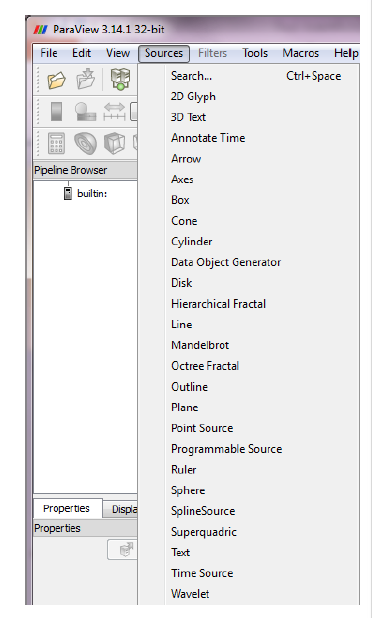

{::options parse_block_html="true" /}


<section>
# {{page.title}}

{{page.author}}

<small></small>

<small>*{{page.date}}*</small>

</section>

<section>
# Sources
* Many tutorials with example data
  - [Kitware](https://www.paraview.org/Wiki/The_ParaView_Tutorial)
  - [DKRZ](https://www.dkrz.de/up/services/analysis/visualization/sw/paraview/tutorial/paraview-tutorial-doc)
  - R. Ponzini [HPC/OpenFOAM post-processing in Paraview](http://www.training.prace-ri.eu/training_material/%3ftx_pracetmo_pi1%5buid%5d=392/) ([data](https://hpc-forge.cineca.it/files/OpenFOAM/public/))
  - [BU tech](http://www.bu.edu/tech/support/research/training-consulting/online-tutorials/paraview/)
</section>

<section>
# Workflow to make a figure
* Create a data source (load data)
* Inspect available variables and ranges
* Adjust view and display settings
* Adjust representation and coloring
* Adjust text and legend
</section>

<section>

# Sources
Add data to 3D scene
* as VTK source objects
* load files using readers

</section>

<section data-background="img/pv-filters.png" data-background-size="contain">

# Filters

</section>

<section data-background="img/pv-customized-filters.png" data-background-size="contain">

# Customized Filters

</section>

<section>
# Work with filters
Perform basic filtering on the provided data
* Slicing
* Iso-surface
* Extract surface
* Clipping
* Vectors
* Streamlines
</section>

<section>
</section>
